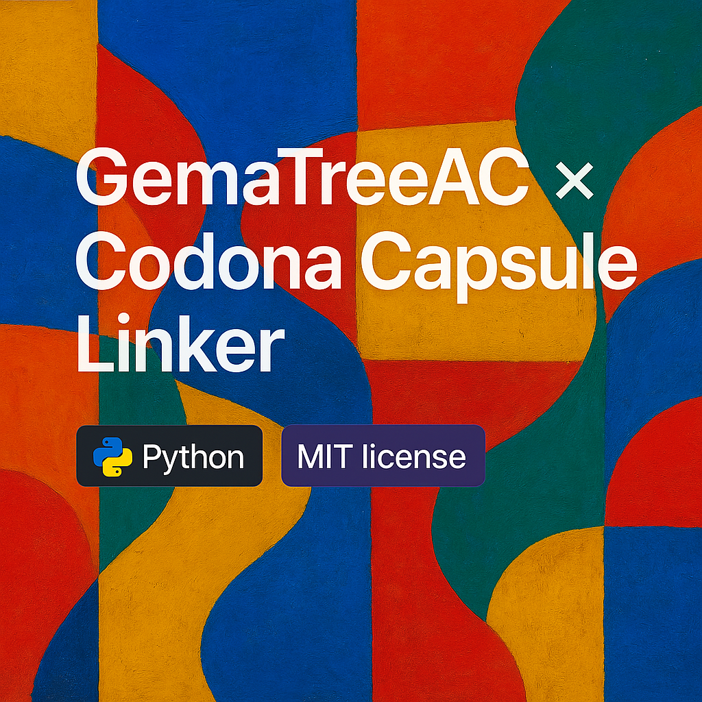

# 🌱 GemaTreeAC × Codona Capsule Linker

This Python module connects [GemaTreeAC](https://github.com/jaakkopee/gematreeac) to the Codona Shrine Console—transforming gematria trees into audio–visual capsule payloads.

## What it does

- Accepts a phrase (e.g. "Amrita")
- Calculates gematria value and reduces to root
- Maps digital root to tone arc and vowel arc
- Outputs `CodonaCapsule_[phrase].json` containing capsule data

## Example Output

```json
{
  "phrase": "AMRITA",
  "digitalRoot": 3,
  "toneArc": [432, 384, 432],
  "vowelArc": ["A", "I", "A"],
  "cipherTrail": {
    "Ordinal": 84,
    "ReductionSteps": [84, 12, 3]
  },
  "glyph": "GlyphOverlay_Amrita.svg",
  "mode": "SpiralBreath"
}
